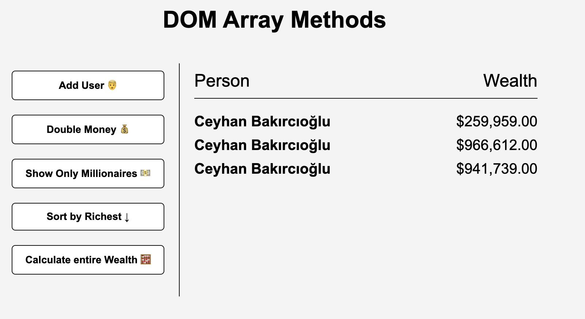

# DOM Array Methods

An interactive web application that demonstrates the use of JavaScript array methods to manipulate and display data dynamically in the DOM. This project allows users to simulate managing a list of people and their wealth.

## Features

- **Add Random Users**: Generate random user profiles with wealth values.
- **Double Wealth**: Multiply the wealth of all users by 2.
- **Filter Millionaires**: Display only users with wealth greater than $1,000,000.
- **Sort by Richest**: Sort the users in descending order based on their wealth.
- **Calculate Total Wealth**: Compute and display the total wealth of all users.

## Technologies Used

- HTML
- CSS
- JavaScript

## How to Use

- Clone the repository.
- Open `index.html` in your browser.
- Use the buttons to interact with the data and see the results dynamically update in the DOM.
